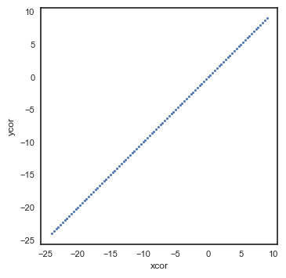
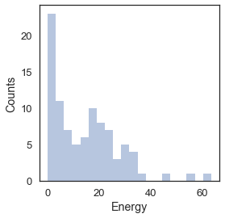
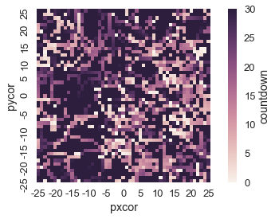
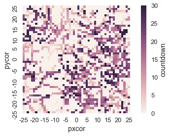

Example 1: NetLogo interaction through the pyNetLogo connector
--------------------------------------------------------------

This notebook provides a simple example of interaction between a NetLogo
model and the Python environment, using the Wolf Sheep Predation model
included in the NetLogo example library (Wilensky, 1999). This model is
slightly modified to add additional agent properties and illustrate the
exchange of different data types. All files used in the example are
available from the pyNetLogo repository at
https://github.com/quaquel/pyNetLogo.

We start by instantiating a link to NetLogo, loading the model, and
executing the ``setup`` command in NetLogo.

.. code:: python

    %matplotlib inline
    import numpy as np
    import pandas as pd
    import matplotlib.pyplot as plt
    import seaborn as sns
    sns.set_style('white')
    sns.set_context('talk')
    
    import jpype
    import pyNetLogo.pyNetLogo
    
    
    netlogo = pyNetLogo.pyNetLogo.NetLogoLink(gui=True)
    
    netlogo.load_model(r'Wolf Sheep Predation_v6.nlogo')
    netlogo.command('setup')

We can use the ``write_NetLogo_attriblist`` method to pass properties to
agents from a Pandas dataframe – for instance, initial values for given
attributes. This improves performance by simultaneously setting multiple
properties for multiple agents in a single function call.

As an example, we first load data from an Excel file into a dataframe.
Each row corresponds to an agent, with columns for each attribute
(including the ``who`` NetLogo identifier, which is required). In this
case, we set coordinates for the agents using the ``xcor`` and ``ycor``
attributes.

.. code:: python

    agent_xy = pd.read_excel('xy_DataFrame.xlsx')
    agent_xy[['who','xcor','ycor']].head(5)

.. raw:: html

    

    <table border="1" class="dataframe">
      <thead>
        <tr style="text-align: right;">
          <th></th>
          <th>who</th>
          <th>xcor</th>
          <th>ycor</th>
        </tr>
      </thead>
      <tbody>
        <tr>
          <th>0</th>
          <td>0</td>
          <td>-24.000000</td>
          <td>-24.000000</td>
        </tr>
        <tr>
          <th>1</th>
          <td>1</td>
          <td>-23.666667</td>
          <td>-23.666667</td>
        </tr>
        <tr>
          <th>2</th>
          <td>2</td>
          <td>-23.333333</td>
          <td>-23.333333</td>
        </tr>
        <tr>
          <th>3</th>
          <td>3</td>
          <td>-23.000000</td>
          <td>-23.000000</td>
        </tr>
        <tr>
          <th>4</th>
          <td>4</td>
          <td>-22.666667</td>
          <td>-22.666667</td>
        </tr>
      </tbody>
    </table>
    

|

We can then pass the dataframe to NetLogo, specifying which attributes
and which agent type we want to update:

.. code:: python

    netlogo.write_NetLogo_attriblist(agent_xy[['who','xcor','ycor']], 'a-sheep')

We can check the data exchange by returning data from NetLogo to the
Python workspace, using the report method. In the example below, this
returns arrays for the ``xcor`` and ``ycor`` coordinates of the
``sheep`` agents, sorted by their ``who`` number. These are then plotted
on a conventional scatter plot.

The ``report`` method directly passes a string to the NetLogo instance,
so that the command syntax may need to be adjusted depending on the
NetLogo version. The ``netlogo_version`` property of the link object can
be used to check the current version. By default, the link object will
use the most recent NetLogo version which was found.

.. code:: python

    if netlogo.netlogo_version == '6':
        x = netlogo.report('map [s -> [xcor] of s] sort sheep')
        y = netlogo.report('map [s -> [ycor] of s] sort sheep')
    elif netlogo.netlogo_version == '5':
        x = netlogo.report('map [[xcor] of ?1] sort sheep')
        y = netlogo.report('map [[ycor] of ?1] sort sheep')

.. code:: python

    fig, ax = plt.subplots(1)
    
    ax.scatter(x, y, s=4)
    ax.set_xlabel('xcor')
    ax.set_ylabel('ycor')
    ax.set_aspect('equal')
    fig.set_size_inches(5,5)
    
    plt.show()

We can then run the model for 100 ticks and update the Python coordinate
arrays for the sheep agents, and return an additional array for each
agent’s energy value. The latter is plotted on a histogram for each
agent type.

.. code:: python

    #We can use either of the following commands to run for 100 ticks:
    
    netlogo.command('repeat 100 [go]')
    #netlogo.repeat_command('go', 100)
    
    if netlogo.netlogo_version == '6':
        #Return sorted arrays so that the x, y and energy properties of each agent are in the same order
        x = netlogo.report('map [s -> [xcor] of s] sort sheep')
        y = netlogo.report('map [s -> [ycor] of s] sort sheep')
        energy_sheep = netlogo.report('map [s -> [energy] of s] sort sheep')
    elif netlogo.netlogo_version == '5':
        x = netlogo.report('map [[xcor] of ?1] sort sheep')
        y = netlogo.report('map [[ycor] of ?1] sort sheep')
        energy_sheep = netlogo.report('map [[energy] of ?1] sort sheep')
         
    energy_wolves = netlogo.report('[energy] of wolves') #NetLogo returns these in random order

.. code:: python

    from mpl_toolkits.axes_grid1 import make_axes_locatable
    
    fig, ax = plt.subplots(1, 2)
    
    sc = ax[0].scatter(x, y, s=50, c=energy_sheep, cmap=plt.cm.coolwarm)
    ax[0].set_xlabel('xcor')
    ax[0].set_ylabel('ycor')
    ax[0].set_aspect('equal')
    divider = make_axes_locatable(ax[0])
    cax = divider.append_axes('right', size='5%', pad=0.1)
    cbar = plt.colorbar(sc, cax=cax, orientation='vertical')
    cbar.set_label('Energy of sheep')
    
    sns.distplot(energy_sheep, kde=False, bins=10, ax=ax[1], label='Sheep')
    sns.distplot(energy_wolves, kde=False, bins=10, ax=ax[1], label='Wolves')
    ax[1].set_xlabel('Energy')
    ax[1].set_ylabel('Counts')
    ax[1].legend()
    fig.set_size_inches(14,5)
    
    plt.show()

.. image:: example1_files/example1_11_0.png

The ``repeat_report`` method returns a Pandas dataframe containing
reported values over a given number of ticks, for one or multiple
reporters. By default, this assumes the model is run with the “go”
NetLogo command; this can be set by passing an optional ``go`` argument.

The dataframe is indexed by ticks, with labeled columns for each
reporter. In this case, we track the number of wolf and sheep agents
over 200 ticks; the outcomes are first plotted as a function of time.
The number of wolf agents is then plotted as a function of the number of
sheep agents, to approximate a phase-space plot.

.. code:: python

    counts = netlogo.repeat_report(['count wolves','count sheep'], 200, go='go')

.. code:: python

    fig, ax = plt.subplots(1, 2)
    
    counts.plot(x=counts.index, ax=ax[0])
    ax[0].set_xlabel('Ticks')
    ax[0].set_ylabel('Counts')
    ax[1].plot(counts['count wolves'], counts['count sheep'])
    ax[1].set_xlabel('Wolves')
    ax[1].set_ylabel('Sheep')
    fig.set_size_inches(12,5)
    
    plt.show()

.. image:: example1_files/example1_14_0.png

The ``repeat_report`` method can also be used with reporters that return
a NetLogo list. In this case, the list is converted to a numpy array. As
an example, we track the energy of the wolf and sheep agents over 5
ticks, and plot the distribution of the wolves’ energy at the final tick
recorded in the dataframe.

To illustrate different data types, we also track the
``[sheep_str] of sheep`` reporter (which returns a string property
across the sheep agents, converted to a numpy object array),
``count sheep`` (returning a single numerical variable), and
``glob_str`` (returning a single string variable).

.. code:: python

    energy_df = netlogo.repeat_report(['[energy] of wolves',
                                       '[energy] of sheep',
                                       '[sheep_str] of sheep',
                                       'count sheep',
                                       'glob_str'], 5)
    
    fig, ax = plt.subplots(1)
    
    sns.distplot(energy_df['[energy] of wolves'].iloc[-1], kde=False, bins=20, ax=ax)
    ax.set_xlabel('Energy')
    ax.set_ylabel('Counts')
    fig.set_size_inches(4,4)
    
    plt.show()

.. code:: python

    energy_df.head()

.. raw:: html

    

    <table border="1" class="dataframe">
      <thead>
        <tr style="text-align: right;">
          <th></th>
          <th>[energy] of wolves</th>
          <th>[energy] of sheep</th>
          <th>[sheep_str] of sheep</th>
          <th>count sheep</th>
          <th>glob_str</th>
        </tr>
      </thead>
      <tbody>
        <tr>
          <th>100.0</th>
          <td>[6.875, 6.875, 12.37890625, 52.21875, 8.091064...</td>
          <td>[6.3125, 0.9375, 5.8359375, 7.5, 6.9453125, 6....</td>
          <td>[sheep, sheep, sheep, sheep, sheep, sheep, she...</td>
          <td>212</td>
          <td>global</td>
        </tr>
        <tr>
          <th>101.0</th>
          <td>[17.609375, 11.37890625, 31.45703125, 2.189453...</td>
          <td>[18.65625, 4.2109375, 7.712890625, 15.6640625,...</td>
          <td>[sheep, sheep, sheep, sheep, sheep, sheep, she...</td>
          <td>206</td>
          <td>global</td>
        </tr>
        <tr>
          <th>102.0</th>
          <td>[16.609375, 34.37890625, 42.8125, 10.6015625, ...</td>
          <td>[0.875, 8.859375, 0.109375, 28.53125, 21.36718...</td>
          <td>[sheep, sheep, sheep, sheep, sheep, sheep, she...</td>
          <td>196</td>
          <td>global</td>
        </tr>
        <tr>
          <th>103.0</th>
          <td>[35.265625, 8.98901367188, 81.328125, 11.17187...</td>
          <td>[22.25, 20.875, 6.2109375, 18.75, 1.328125, 11...</td>
          <td>[sheep, sheep, sheep, sheep, sheep, sheep, she...</td>
          <td>193</td>
          <td>global</td>
        </tr>
        <tr>
          <th>104.0</th>
          <td>[37.609375, 14.8125, 46.25, 7.390625, 9.601562...</td>
          <td>[17.359375, 1.71484375, 22.03125, 9.5036621093...</td>
          <td>[sheep, sheep, sheep, sheep, sheep, sheep, she...</td>
          <td>187</td>
          <td>global</td>
        </tr>
      </tbody>
    </table>
    

|

The ``patch_report`` method can be used to return a dataframe which (for
this example) contains the ``countdown`` attribute of each NetLogo
patch. This dataframe essentially replicates the NetLogo environment,
with column labels corresponding to the xcor patch coordinates, and
indices following the pycor coordinates.

.. code:: python

    countdown_df = netlogo.patch_report('countdown')
    
    fig, ax = plt.subplots(1)
    
    patches = sns.heatmap(countdown_df, xticklabels=5, yticklabels=5, cbar_kws={'label':'countdown'}, ax=ax)
    ax.set_xlabel('pxcor')
    ax.set_ylabel('pycor')
    ax.set_aspect('equal')
    fig.set_size_inches(8,4)
    
    plt.show()

The dataframes can be manipulated with any of the existing Pandas
functions, for instance by exporting to an Excel file. The ``patch_set``
method provides the inverse functionality to ``patch_report``, and
updates the NetLogo environment from a dataframe.

.. code:: python

    countdown_df.to_excel('countdown.xlsx')
    netlogo.patch_set('countdown', countdown_df.max()-countdown_df)

.. code:: python

    countdown_update_df = netlogo.patch_report('countdown')
    
    fig, ax = plt.subplots(1)
    
    patches = sns.heatmap(countdown_update_df, xticklabels=5, yticklabels=5, cbar_kws={'label':'countdown'}, ax=ax)
    ax.set_xlabel('pxcor')
    ax.set_ylabel('pycor')
    ax.set_aspect('equal')
    fig.set_size_inches(8,4)
    
    plt.show()

Finally, the ``kill_workspace()`` method shuts down the NetLogo
instance.

.. code:: python

    netlogo.kill_workspace()
