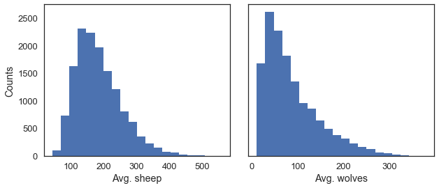
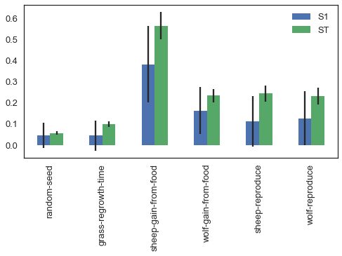

Example 2: Sensitivity analysis for a NetLogo model with SALib and ipyparallel
------------------------------------------------------------------------------

This provides a more advanced example of interaction between NetLogo and
a Python environment, using the SALib library (Herman & Usher, 2017;
available through the pip package manager) to sample and analyze a
suitable experimental design for a Sobol global sensitivity analysis.
Furthermore, the ipyparallel package (also available on pip) is used to
parallelize the simulations.

An interactive Jupyter notebook version, as well as the model files used
in the example, are available from the pyNetLogo repository at
https://github.com/quaquel/pyNetLogo.

.. code:: python

    #Ensuring compliance of code with both python2 and python3
    
    from __future__ import division, print_function
    try:
        from itertools import izip as zip
    except ImportError: # will be 3.x series
        pass

.. code:: python

    import numpy as np
    import pandas as pd
    import matplotlib.pyplot as plt
    import seaborn as sns
    sns.set_style('white')
    sns.set_context('talk')
    
    import jpype
    import pyNetLogo.pyNetLogo
    
    #Import the sampling and analysis modules for a Sobol variance-based 
    #sensitivity analysis
    from SALib.sample import saltelli
    from SALib.analyze import sobol

SALib relies on a problem definition dictionary which contains the
number of input parameters to sample, their names (which should here
correspond to a NetLogo global variable), and the sampling bounds.
Documentation for SALib can be found at
https://salib.readthedocs.io/en/latest/.

.. code:: python

    problem = { 
      'num_vars': 6,
      'names': ['random-seed',
                'grass-regrowth-time',
                'sheep-gain-from-food',
                'wolf-gain-from-food',
                'sheep-reproduce',
                'wolf-reproduce'], 
      'bounds': [[1, 100000],
                 [20., 40.], 
                 [2., 8.], 
                 [16., 32.],
                 [2., 8.],
                 [2., 8.]]
    }

The SALib sampler will automatically generate an appropriate number of
samples for Sobol analysis, using a revised Saltelli sampling sequence.
To calculate first-order, second-order and total sensitivity indices,
this gives a sample size of *n(2p+2)*, where *p* is the number of input
parameters, and *n* is a baseline sample size which should be large
enough to stabilize the estimation of the indices. For this example, we
use *n* = 1000, for a total of 14000 experiments.

.. code:: python

    n = 1000
    param_values = saltelli.sample(problem, n, calc_second_order=True)

The sampler generates an input array of shape (*n(2p+2)*, *p*) with rows
for each experiment and columns for each input parameter.

.. code:: python

    param_values.shape

.. parsed-literal::

    (14000, 6)

Running the experiments in parallel using ipyparallel
~~~~~~~~~~~~~~~~~~~~~~~~~~~~~~~~~~~~~~~~~~~~~~~~~~~~~

Ipyparallel is a standalone package (available through the pip package
manager) which can be used to interactively run parallel tasks from
IPython on a single PC, but also on multiple computers. On machines with
multiple cores, this can significantly improve performance: for
instance, the multiple simulations required for a sensitivity analysis
are easy to run in parallel. Documentation for Ipyparallel is available
at http://ipyparallel.readthedocs.io/en/latest/intro.html.

Ipyparallel first requires starting a controller and multiple engines,
which can be done from a terminal or command prompt with the following:

``ipcluster start -n 4``

The optional -n argument specifies the number of processes to start (4
in this case).

Next, we can connect the interactive notebook to the started cluster by
instantiating a client, and checking that client.ids returns a list of 4
available engines.

.. code:: python

    import ipyparallel
    
    client = ipyparallel.Client()
    client.ids

.. parsed-literal::

    [0, 1, 2, 3]

We then set up the engines so that they can run the simulations, using a
“direct view” that accesses all engines.

We first need to change the working directories to import pyNetLogo on
the engines (assuming the pyNetLogo module is located in the same
directory as this notebook, rather than being on the Python path). This
also ensures we have the proper path to the file we need to load. We
also send the SALib problem definition variable to the workspace of the
engines, so that it can be used in the simulation.

Note: there are various solutions to both problems. For example, we
could make the NetLogo file a keyword argument and pass the absolute
path to it.

.. code:: python

    direct_view = client[:]

.. code:: python

    import os
    
    #Push the current working directory of the notebook to a "cwd" variable on the engines that can be accessed later
    direct_view.push(dict(cwd=os.getcwd()))

.. parsed-literal::

    <AsyncResult: _push>

.. code:: python

    #Push the "problem" variable from the notebook to a corresponding variable on the engines
    direct_view.push(dict(problem=problem))

.. parsed-literal::

    <AsyncResult: _push>

The ``%%px`` command can be added to a notebook cell to run it in
parallel on each of the engines. Here the code first involves some
imports and a change of the working directory. We then start a link to
NetLogo, and load the example model on each of the engines.

.. code:: python

    %%px 
    
    import os
    os.chdir(cwd)
    
    import jpype
    import pyNetLogo.pyNetLogo
    import pandas as pd
    import numpy as np
    
    netlogo = pyNetLogo.pyNetLogo.NetLogoLink(gui=False)
    netlogo.load_model(r'Wolf Sheep Predation_v6.nlogo')

We can then use the IPyparallel map functionality to run the sampled
experiments, now using a “load balanced” view to automatically handle
the scheduling and distribution of the simulations across the engines.
This is for instance useful when simulations may take different amounts
of time.

We first set up a simulation function that takes a single experiment
(i.e. a vector of input parameters) as an argument, and returns the
outcomes of interest in a pandas Series.

.. code:: python

    def simulation(experiment):
        
        #Set the input parameters
        for i, name in enumerate(problem['names']):
            if name == 'random-seed':
                #The NetLogo random seed requires a different syntax
                netlogo.command('random-seed {}'.format(experiment[i]))
            else:
                #Otherwise, assume the input parameters are global variables
                netlogo.command('set {0} {1}'.format(name, experiment[i]))
    
        netlogo.command('setup')
        #Run for 100 ticks and return the number of sheep and wolf agents at each time step
        counts = netlogo.repeat_report(['count sheep','count wolves'], 100)    
        
        results = pd.Series([counts['count sheep'].values.mean(), 
                             counts['count wolves'].values.mean()], 
                             index=['Avg. sheep', 'Avg. wolves'])
        
        return results

We then create a load balanced view and run the simulation with the
``map_sync`` method. This method takes a function and a Python sequence
as arguments, applies the function to each element of the sequence, and
returns results once all computations are finished.

In this case, we pass the simulation function and the array of
experiments (param_values), so that the function will be executed for
each row of the array.

The DataFrame constructor is then used to immediately build a DataFrame
from the results (which are returned as a list of Series). The
``to_csv`` method provides a simple way of saving the results to disk;
pandas supports several more advanced storage options, such as
serialization with msgpack, or hierarchical HDF5 storage.

.. code:: python

    lview = client.load_balanced_view()
    
    t0 = time.time()
    results = pd.DataFrame(lview.map_sync(simulation, param_values))

.. code:: python

    results.to_csv('Sobol_parallel.csv')

.. code:: python

    results.head(5)

.. raw:: html

    

    <table border="1" class="dataframe">
      <thead>
        <tr style="text-align: right;">
          <th></th>
          <th>Avg. sheep</th>
          <th>Avg. wolves</th>
        </tr>
      </thead>
      <tbody>
        <tr>
          <th>0</th>
          <td>125.25</td>
          <td>91.52</td>
        </tr>
        <tr>
          <th>1</th>
          <td>136.85</td>
          <td>110.37</td>
        </tr>
        <tr>
          <th>2</th>
          <td>125.98</td>
          <td>84.50</td>
        </tr>
        <tr>
          <th>3</th>
          <td>136.46</td>
          <td>106.76</td>
        </tr>
        <tr>
          <th>4</th>
          <td>284.34</td>
          <td>55.39</td>
        </tr>
      </tbody>
    </table>
    

Using SALib for sensitivity analysis
~~~~~~~~~~~~~~~~~~~~~~~~~~~~~~~~~~~~

We can then proceed with the analysis, first using a histogram to
visualize output distributions for each outcome:

.. code:: python

    fig, ax = plt.subplots(1,len(results.columns), sharey=True)
    
    for i, n in enumerate(results.columns):
        ax[i].hist(results[n], 20)
        ax[i].set_xlabel(n)
    ax[0].set_ylabel('Counts')
    
    fig.set_size_inches(10,4)
    fig.subplots_adjust(wspace=0.1)
    
    plt.show()

Bivariate scatter plots can be useful to visualize relationships between
each input parameter and the outputs. Taking the outcome for the average
sheep count as an example, we obtain the following, using the scipy
library to calculate the Pearson correlation coefficient (r) for each
parameter, and the seaborn library to plot a linear trend fit.

.. code:: python

    import scipy
    
    nrow=2
    ncol=3
    
    fig, ax = plt.subplots(nrow, ncol, sharey=True)
    
    y = results['Avg. sheep']
    
    for i, a in enumerate(ax.flatten()):
        x = param_values[:,i]
        sns.regplot(x, y, ax=a, ci=None, color='k',scatter_kws={'alpha':0.2, 's':4, 'color':'gray'})
        pearson = scipy.stats.pearsonr(x, y)
        a.annotate("r: {:6.3f}".format(pearson[0]), xy=(0.15, 0.85), xycoords='axes fraction',fontsize=13)
        if divmod(i,ncol)[1]>0:
            a.get_yaxis().set_visible(False)
        a.set_xlabel(problem['names'][i])
        a.set_ylim([0,1.1*np.max(y)])
    
    fig.set_size_inches(9,9,forward=True) 
    fig.subplots_adjust(wspace=0.2, hspace=0.3)
    
    plt.show()

.. image:: example2_files/example2_27_0.png

This indicates a positive relationship between the
“sheep-gain-from-food” parameter and the mean sheep count, and negative
relationships for the “wolf-gain-from-food” and “wolf-reproduce”
parameters.

We can then use SALib to calculate first-order (S1), second-order (S2)
and total (ST) Sobol indices, to estimate each input’s contribution to
output variance as well as input interactions (again using the mean
sheep count). By default, 95% confidence intervals are estimated for
each index.

.. code:: python

    Si = sobol.analyze(problem, results['Avg. sheep'].values, calc_second_order=True, print_to_console=False)

As a simple example, we first select and visualize the total and
first-order indices for each input, converting the dictionary returned
by SALib to a DataFrame. The default pandas plotting method is then used
to plot these indices along with their estimated confidence intervals
(shown as error bars).

.. code:: python

    Si_filter = {k:Si[k] for k in ['ST','ST_conf','S1','S1_conf']}
    Si_df = pd.DataFrame(Si_filter, index=problem['names'])

.. code:: python

    Si_df

.. raw:: html

    

    <table border="1" class="dataframe">
      <thead>
        <tr style="text-align: right;">
          <th></th>
          <th>S1</th>
          <th>S1_conf</th>
          <th>ST</th>
          <th>ST_conf</th>
        </tr>
      </thead>
      <tbody>
        <tr>
          <th>random-seed</th>
          <td>0.047530</td>
          <td>0.059873</td>
          <td>0.057656</td>
          <td>0.008165</td>
        </tr>
        <tr>
          <th>grass-regrowth-time</th>
          <td>0.044884</td>
          <td>0.070364</td>
          <td>0.099517</td>
          <td>0.013105</td>
        </tr>
        <tr>
          <th>sheep-gain-from-food</th>
          <td>0.381961</td>
          <td>0.180561</td>
          <td>0.564394</td>
          <td>0.065388</td>
        </tr>
        <tr>
          <th>wolf-gain-from-food</th>
          <td>0.163731</td>
          <td>0.110766</td>
          <td>0.233807</td>
          <td>0.030697</td>
        </tr>
        <tr>
          <th>sheep-reproduce</th>
          <td>0.112766</td>
          <td>0.120720</td>
          <td>0.244354</td>
          <td>0.037166</td>
        </tr>
        <tr>
          <th>wolf-reproduce</th>
          <td>0.126855</td>
          <td>0.128140</td>
          <td>0.232260</td>
          <td>0.040492</td>
        </tr>
      </tbody>
    </table>
    

.. code:: python

    fig, ax = plt.subplots(1)
    
    indices = Si_df[['S1','ST']]
    err = Si_df[['S1_conf','ST_conf']]
    
    indices.plot.bar(yerr=err.values.T,ax=ax)
    fig.set_size_inches(8,4)
    
    plt.show()

The “sheep-gain-from-food” parameter has the highest ST index,
indicating that it contributes over 50% of output variance when
accounting for interactions with other parameters. However, it can be
noted that confidence bounds are still quite broad with this sample
size, particularly for the S1 index (which indicates each input’s
individual contribution to variance).

We can use a more sophisticated visualization to include the
second-order interactions between inputs estimated from the S2 values.

.. code:: python

    import itertools
    from math import pi
    
    
    def normalize(x, xmin, xmax):
        return (x-xmin)/(xmax-xmin)
    
    
    def plot_circles(ax, locs, names, max_s, stats, smax, smin, fc, ec, lw, 
                     zorder):
        s = np.asarray([stats[name] for name in names])
        s = 0.01 + max_s * np.sqrt(normalize(s, smin, smax))
        
        fill = True
        for loc, name, si in zip(locs, names, s):
            if fc=='w':
                fill=False
            else:
                ec='none'
                
            x = np.cos(loc)
            y = np.sin(loc)
            
            circle = plt.Circle((x,y), radius=si, ec=ec, fc=fc, transform=ax.transData._b,
                                zorder=zorder, lw=lw, fill=True)
            ax.add_artist(circle)
            
    
    def filter(sobol_indices, names, locs, criterion, threshold):
        if criterion in ['ST', 'S1', 'S2']:
            data = sobol_indices[criterion]
            data = np.abs(data)
            data = data.flatten() # flatten in case of S2
            # TODO:: remove nans
            
            filtered = ([(name, locs[i]) for i, name in enumerate(names) if 
                         data[i]>threshold])
            filtered_names, filtered_locs = zip(*filtered)
        elif criterion in ['ST_conf', 'S1_conf', 'S2_conf']:
            raise NotImplementedError
        else:
            raise ValueError('unknown value for criterion')
    
        return filtered_names, filtered_locs
    
    
    def plot_sobol_indices(sobol_indices, criterion='ST', threshold=0.01):
        '''plot sobol indices on a radial plot
        
        Parameters
        ----------
        sobol_indices : dict
                        the return from SAlib
        criterion : {'ST', 'S1', 'S2', 'ST_conf', 'S1_conf', 'S2_conf'}, optional
        threshold : float
                    only visualize variables with criterion larger than cutoff
                 
        '''
        max_linewidth_s2 = 15
        max_s_radius = 0.3
        
        # prepare data
        # use the absolute values of all the indices
        sobol_indices = {key:np.abs(stats) for key, stats in sobol_indices.items()}
        
        # dataframe with ST and S1
        sobol_stats = {key:sobol_indices[key] for key in ['ST', 'S1']}
        sobol_stats = pd.DataFrame(sobol_stats, index=problem['names'])
    
        smax = sobol_stats.max().max()
        smin = sobol_stats.min().min()
    
        # dataframe with s2
        s2 = pd.DataFrame(sobol_indices['S2'], index=problem['names'], 
                          columns=problem['names'])
        s2max = s2.max().max()
        s2min = s2.min().min()
    
        names = problem['names']
        n = len(names)
        ticklocs = np.linspace(0, 2*pi, n+1)
        locs = ticklocs[0:-1]
    
        filtered_names, filtered_locs = filter(sobol_indices, names, locs,
                                               criterion, threshold)
        
        # setup figure
        fig = plt.figure()
        ax = fig.add_subplot(111, polar=True)
        ax.grid(False)
        ax.spines['polar'].set_visible(False)
        ax.set_xticks(ticklocs)
        ax.set_xticklabels(names)
        ax.set_yticklabels([])
        ax.set_ylim(ymax=1.4)
        legend(ax)
    
        # plot ST
        plot_circles(ax, filtered_locs, filtered_names, max_s_radius, 
                     sobol_stats['ST'], smax, smin, 'w', 'k', 1, 9)
    
        # plot S1
        plot_circles(ax, filtered_locs, filtered_names, max_s_radius, 
                     sobol_stats['S1'], smax, smin, 'k', 'k', 1, 10)
    
        # plot S2
        for name1, name2 in itertools.combinations(zip(filtered_names, filtered_locs), 2):
            name1, loc1 = name1
            name2, loc2 = name2
    
            weight = s2.ix[name1, name2]
            lw = 0.5+max_linewidth_s2*normalize(weight, s2min, s2max)
            ax.plot([loc1, loc2], [1,1], c='darkgray', lw=lw, zorder=1)
    
        return fig
    
    
    from matplotlib.legend_handler import HandlerPatch
    class HandlerCircle(HandlerPatch):
        def create_artists(self, legend, orig_handle,
                           xdescent, ydescent, width, height, fontsize, trans):
            center = 0.5 * width - 0.5 * xdescent, 0.5 * height - 0.5 * ydescent
            p = plt.Circle(xy=center, radius=orig_handle.radius)
            self.update_prop(p, orig_handle, legend)
            p.set_transform(trans)
            return [p]
    
    def legend(ax):
        some_identifiers = [plt.Circle((0,0), radius=5, color='k', fill=False, lw=1),
                            plt.Circle((0,0), radius=5, color='k', fill=True),
                            plt.Line2D([0,0.5], [0,0.5], lw=8, color='darkgray')]
        ax.legend(some_identifiers, ['ST', 'S1', 'S2'],
                  loc=(1,0.75), borderaxespad=0.1, mode='expand',
                  handler_map={plt.Circle: HandlerCircle()})
    
    
    sns.set_style('whitegrid')
    fig = plot_sobol_indices(Si, criterion='ST', threshold=0.005)
    fig.set_size_inches(7,7)
    
    plt.show()

.. image:: example2_files/example2_35_0.png

In this case, the “sheep-gain-from-food” variable has strong
interactions with the “wolf-gain-from-food” and “wolf-reproduce” inputs
in particular. The size of the ST and S1 circles correspond to the
normalized variable importances.

Finally, the kill_workspace() function shuts down the NetLogo instance.

.. code:: python

    netlogo.kill_workspace()
